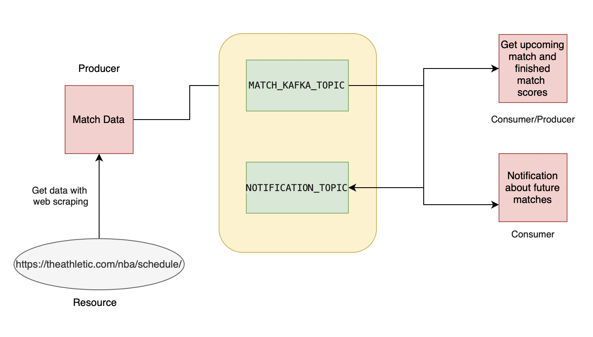
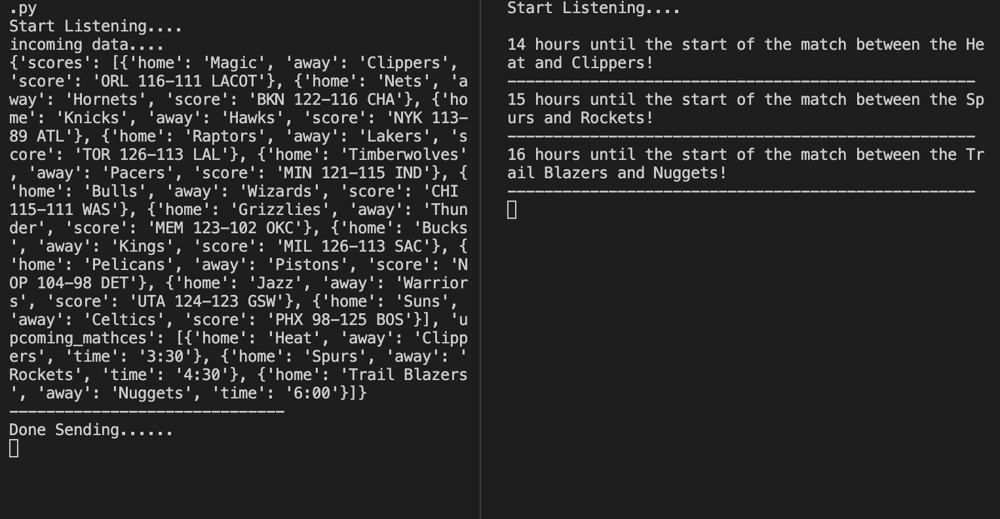

# KafkawithPython

## About Project
NBA data scraped from https://theathletic.com/nba/schedule/ website. In the obtained data, newly finished matches and future match information were sent 
to MATCH_KAFKA_TOPIC in json format. Consumer read and printed the data. Then it transformed this data and sent it to NOTIFICATION_TOPIC. Consumer read 
the data and prints the remaining time as a notification.

## Built with
* Python 
* Kafka

### Check out the project flowchart!

## Sample output from consumers

